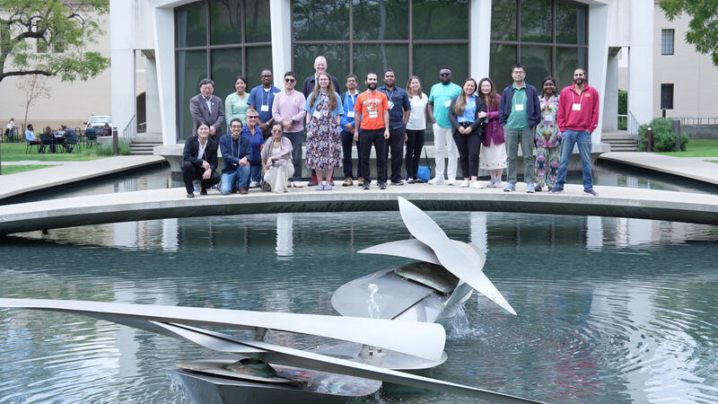

I was lucky enough to be invited to present on Beescape and BeeSpatial at the [American Institute of Mathematics](https://aimath.org/) in Pasadena, California on the CalTech campus. This was for a workshop on ["Addressing declining pollinator populations through new mathematics"](https://aimath.org/pastworkshops/pollinatordecline.html). I had a lot of fun and learned a lot from a diverse group of participants, from USDA scientists, a beekeeper, bee virologists and biologists, and mathematicians. There were some really great discussions and I came away feeling that the landscape data that I've always been into can really contribute to a better understanding of why honey bee colonies are continuing to collapse. Because that's still happening.

Anyways I hope to write more about some the things I learned and ideas that emerged from this workshop in coming posts!

