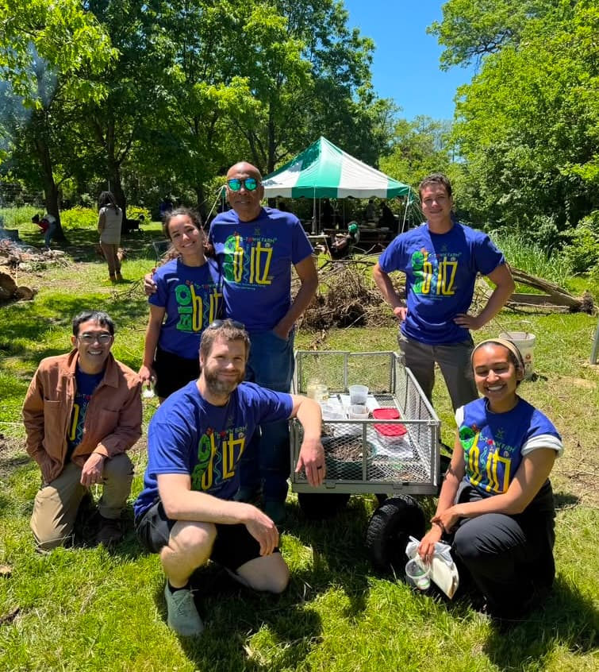

[D-Town farm](https://www.dbcfsn.org/dtownfarm) is Detroit's largest urban farm. It's operated by the Detroit Black Community Food Sovereignty Network, whose goal is to advance Black food sovereignty, community self-determination, and sustainable food systems in Detroit.

Over the years, I've been privileged to contribute to annual BioBlitz events, bringing University of Michigan science resources to kids and their parents in the local community in Detroit. Which means I get to talk to them about cool bugs and plants. This year I again joined some other former students of the Perfectameer Lab to do this. We managed to score cool insect specimens that really got a reaction out of the kids. My favorite was the [tarantula hawk](https://en.wikipedia.org/wiki/Tarantula_hawk). I also had fun talking to the parents who were just excited as the kids, if not more.

BioBlitz events are usually focused on documenting biodiversity through an organized citizen science survey. At some point over its history, the D-Town BioBlitzes have become more about just showing people nature and fostering a community around agroecology and conservation. I think this is the more important mission. And it's effective, as evidenced by the multiple generations of educators and ecologists I've met at D-Town. Thank you Mama Erin and Mama Hanifa for organizing!

