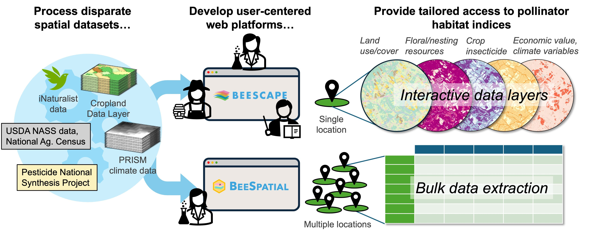

Pollinators, especially bees, provide a key ecosystem service by facilitating flowering plant reproduction and crop production. Supporting bee populations requires an understanding of land cover, foraging and nesting resources, insecticide loading and toxicity, and climate trends in the landscape. However, datasets necessary for assessing bee habitat quality are not conveniently located, interoperable, or readily accessible. Stakeholders also have differing needs and technical capacities.

We developed two complementary web applications that tailor access to bee habitat indicators for a large geographical region, the conterminous United States.

[**Beescape**](https://beescape.psu.edu/) provides bee habitat quality indicators at user-selected locations and is designed from feedback by its main intended users: beekeepers, growers, gardeners, scientists, and conservationists. *Beescape* enables dynamic visualizations of landscape conditions impacting bees to support bee colony and habitat management and general awareness of the local status and relative importance of these factors.

I led development of the web application [**BeeSpatial**](https://beesuite.psu.edu/beespatial/) as a research-focused complement to *Beescape* that gives scientists and geospatial analysts additional data layer selections, functions for multi-location data extraction, and access to underlying geospatial data files to conduct subsequent analysis and processing. To meet its intended users’ needs, *BeeSpatial* returns reproducible data queries at large volumes for research workflows.

Together, these applications extend access to an integrated set of bee habitat quality indicators across audiences. This framework can be applied to other global regions and conservation management contexts, where key geospatial indicators are relevant for a range of stakeholders and supporting data and spatial models exist but are not broadly accessible.

## Past workshops

[**Ecospatial Summit**](https://ecospatialsummit.com/) (*Oct. 10-11, 2024*) As part of the Beescape team, I co-organized a summit that convened a broad range of geospatial conservation data stakeholders to foster knowledge sharing, collaboration, and innovation around spatial data platforms. We featured the *Beescape* and *BeeSpatial* platforms and beyond, touching on ecosystem services and conservation.

- [BeeSpatial workshop materials](https://climateecology.github.io/ecospatial-workshop/index.html)

**Entomological Society of America Annual Meeting** (*Nov. 9-12 ,2025*) The *BeeSpatial* team organized a workshop during the annual meeting featuring data and workflows for mapping pollinator habitats.

- [Workshop materials](https://appliedsystemsecology.github.io/beespatial-workshop/)

## Related publications

::: {#pubs}
:::
