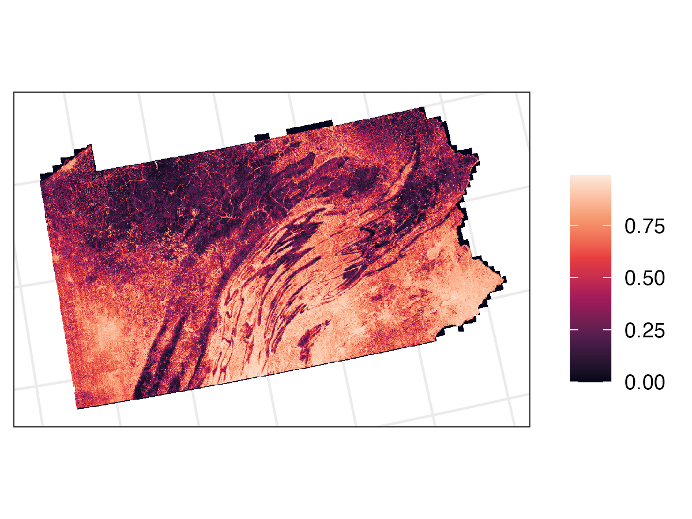
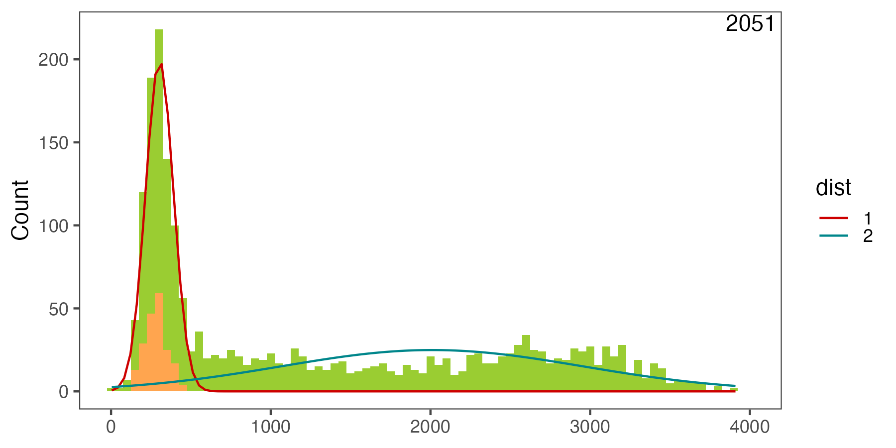
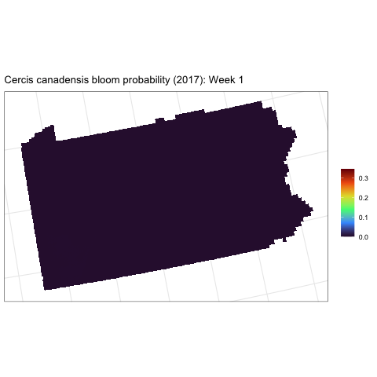

Understanding habitat and floral resource availability is critically important for addressing bee populations declines, and requires models of fine-scale floral dynamics across bee foraging landscapes and over growing seasons. However, comprehensive information is not available at the spatial and temporal resolutions relevant to bees, creating a gap that impedes understanding and conservation management.

Using [Deepbiosphere](https://doi.org/10.1073/pnas.2318296121) (Gillespie et al. 2024), we are modeling the joint distributions of bee floral resource plant species across Pennsylvania and New York, based on over 600,000 citizen science observations from iNaturalist, spanning 2012 to 2022. We use 1 m resolution NAIP aerial imagery from 2017 and 19 bioclimatic variables (BIOCLIM) to predict the spatial distributions of 100 bee floral resource species and over 2,000 other co-occurring plant species.

To estimate bloom times, we are modeling the curves of seasonal peaks in citizen science observations (from iNaturalist) corresponding to flowering for the entire northeastern US, accounting for geographic variations in climate using thermal time (growing degree days). To do this, we use finite mixture models to identify separate curves in a mixed distribution of observation classes.

We can then combine the Deepbiosphere spatial distribution model with the finite mixture model-derived bloom curve over thermal time to estimate blooms over space and time.

