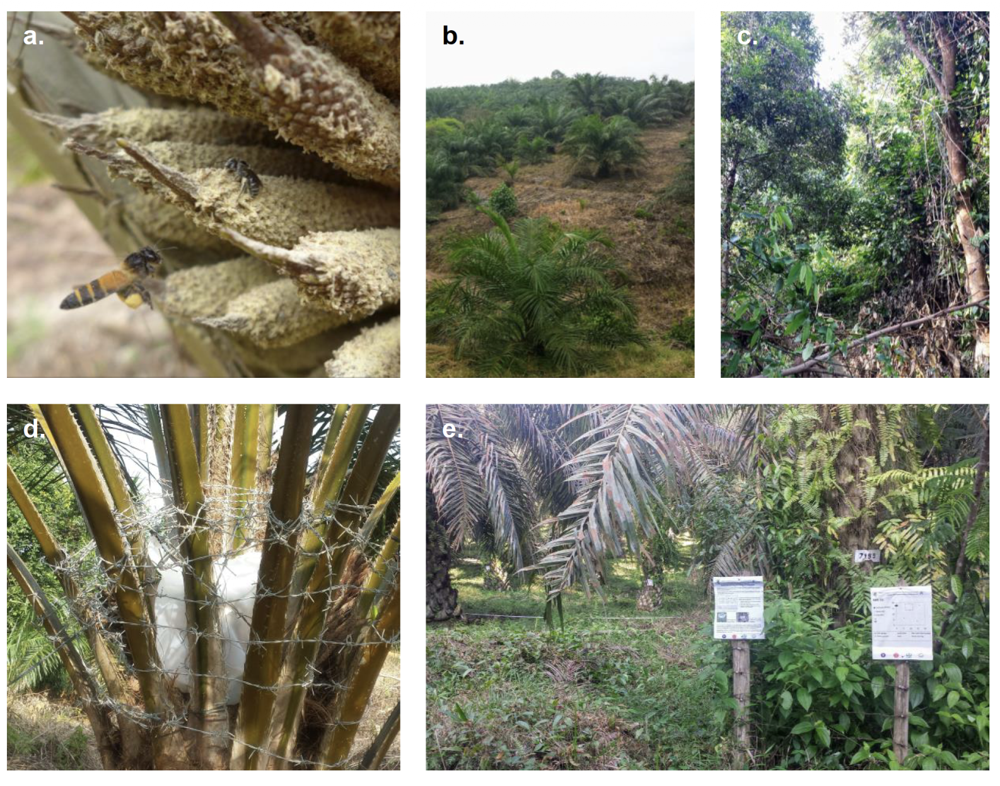

Agricultural expansion and land use change are rapidly transforming tropical landscapes, impacting pollinator species and the services they provide. My dissertation at the University of Göttingen under Teja Tscharntke and Ingo Grass investigates how the conversion of natural forests to agricultural systems, particularly oil palm plantations, affects pollinator biodiversity, ecosystem functions, and pollination services in Jambi Province, Sumatra, Indonesia.

I first reviewed current understanding of oil palm pollination and identified key biological, management, and climate factors that influence yield stability through their effects on pollinators. Field experiments then demonstrated that natural forest proximity enhances fruit set in oil palm, suggesting important biotic interactions between forest and agricultural habitats. Within a long-term biodiversity enrichment experiment, I showed that increasing tree diversity in oil palm plantations indirectly affects ecosystem functions, such as pollination and herbivory, by altering light and vegetation structure. Finally, experiments with native stingless bees (Tetragonula laeviceps) across multiple land use types revealed that structurally complex habitats promote colony survival and growth, while local floral diversity enhances pollen storage and reproductive success.

Together, these studies illustrate that agricultural intensification reduces habitat quality for wild pollinators, but natural habitat and biodiversity restoration can partially offset these losses. By identifying ecological pathways that link land use, biodiversity, and pollination, this work advances our understanding of how ecosystem functions respond to landscape change and provides insight for improving both agricultural sustainability and tropical biodiversity conservation.

## Related publications

::: {#pubs}
:::
